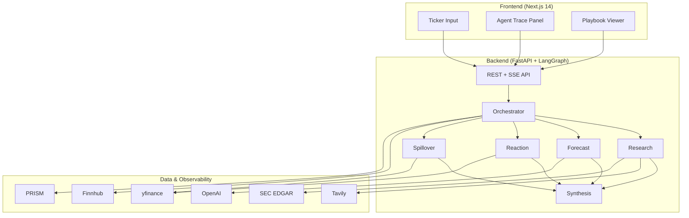

# EarningsPulse

**Know the report. Read the reaction. Watch the ripple.**

AI-powered pre-earnings research agent that generates structured Earnings Playbooks — forecasting report sentiment, modeling price reaction scenarios, and mapping peer spillover.

Built for the [AI x FINANCE HACKATHON – MONEY TALKS](https://luma.com/vljpdtre) (Money Intelligence track).

## Overview

EarningsPulse is a multi-agent system that prepares investors for after-hours earnings events. Before a company reports, it:

1. **Researches** the ticker — news, filings, analyst context (Tavily + SEC EDGAR)
2. **Forecasts** report sentiment — beat/miss probabilities with confidence tiers
3. **Models reactions** — historical patterns including dip-then-rally
4. **Maps spillover** — correlated peers likely to move in sympathy
5. **Synthesizes** a structured **Earnings Playbook** with sources, scenarios, and export

Every agent step is streamed live (SSE) and logged in PRISM-compatible trace format.

## Architecture



| Layer | Stack |
|-------|-------|
| Frontend | Next.js 14, TypeScript, Tailwind CSS |
| Backend | FastAPI, LangGraph, Pydantic v2 |
| LLM | OpenAI GPT-4o |
| Research | Tavily Search API |
| Market data | yfinance, Finnhub |
| Observability | PRISM (Block Convey) + local trace logs |

## Project Structure

```
finance_hackathon/
├── backend/              # FastAPI + LangGraph agents
│   ├── app/              # Application code
│   ├── demo/             # Pre-cached demo playbooks (AAPL)
│   ├── Dockerfile        # Production container
│   └── railway.toml      # Railway deploy config
├── frontend/             # Next.js 14 web app
│   ├── e2e/              # Playwright tests
│   ├── Dockerfile        # Production container
│   └── vercel.json       # Vercel deploy config
├── docs/                 # Spec, plan, deployment, demo script
├── scripts/              # Backtest, demo seed, test & verify utilities
├── render.yaml           # Render blueprint (alternative to Railway)
└── docker-compose.yml    # Local full-stack
```

## Quick Start (local)

### 1. Clone and configure

```bash
cp .env.example .env
# Edit .env with your API keys (not required for Demo AAPL)
```

### 2. Run with Docker (recommended)

```bash
docker compose up --build
```

- Frontend: http://localhost:3000
- Backend API: http://localhost:8000
- API Docs: http://localhost:8000/docs

### 3. Run locally (development)

**Backend:**

```bash
cd backend
python -m venv .venv
source .venv/bin/activate   # Windows: .venv\Scripts\activate
pip install -r requirements.txt
uvicorn app.main:app --reload --port 8000
```

**Frontend:**

```bash
cd frontend
npm install
npm run dev
```

## Production Deployment

Deploy **frontend → Vercel**, **backend → Railway or Render**.

Full step-by-step guide: **[docs/DEPLOYMENT.md](docs/DEPLOYMENT.md)**

Quick checklist:

1. Deploy backend from `backend/` (Dockerfile included)
2. Set `FRONTEND_URL`, `OPENAI_API_KEY`, `TAVILY_API_KEY`, `FINNHUB_API_KEY`, `SEC_USER_AGENT`
3. Deploy frontend from `frontend/` to Vercel
4. Set `NEXT_PUBLIC_BACKEND_URL` to your backend URL
5. Verify:

```bash
./scripts/verify_deployment.sh https://your-api.up.railway.app https://your-app.vercel.app
```

Tag release after verification:

```bash
git tag -a v1.0.0 -m "EarningsPulse v1.0.0 — hackathon release"
git push origin v1.0.0
```

## Demo

**Instant demo (no API keys):** Click **Demo AAPL** on the home page.

**3-minute pitch script:** [docs/DEMO_SCRIPT.md](docs/DEMO_SCRIPT.md)

**Seed / refresh demo cache:**

```bash
cd backend && source .venv/bin/activate
python ../scripts/seed_demo.py --offline --ticker AAPL   # offline
python ../scripts/seed_demo.py --ticker AAPL             # live agent run
```

## API Reference

Interactive docs: `GET /docs` (Swagger UI)

| Method | Endpoint | Description |
|--------|----------|-------------|
| `GET` | `/health` | Liveness probe |
| `GET` | `/ready` | Readiness + key configuration status |
| `POST` | `/api/playbook/generate` | Start playbook generation `{ "ticker": "AAPL" }` |
| `GET` | `/api/playbook/stream/{job_id}` | SSE agent progress stream |
| `GET` | `/api/playbook/{job_id}` | Fetch completed playbook |
| `GET` | `/api/playbook/{job_id}/export/json` | Download playbook JSON |
| `GET` | `/api/playbook/{job_id}/export/bundle` | Download playbook + trace bundle |
| `POST` | `/api/playbook/demo/{ticker}` | Instant demo from cache |
| `GET` | `/api/playbook/demo` | List available demo tickers |
| `GET` | `/api/calendar?days=7` | Upcoming earnings events |
| `GET` | `/api/calendar/{ticker}` | Ticker-specific earnings dates |
| `GET` | `/api/trace/{job_id}` | Full PRISM-compatible trace log |

Rate limit: 10 playbook generation requests per minute per client IP.

### Example — generate and stream

```bash
# Start job
curl -X POST http://localhost:8000/api/playbook/generate \
  -H "Content-Type: application/json" \
  -d '{"ticker": "AAPL"}'

# Stream progress (SSE)
curl -N http://localhost:8000/api/playbook/stream/<job_id>

# Fetch result
curl http://localhost:8000/api/playbook/<job_id>
```

## Health Checks

| Service  | Endpoint |
|----------|----------|
| Backend  | `GET /health` |
| Backend  | `GET /ready` |
| Frontend | `GET /api/health` |

## API Keys

| Key | Purpose | Required for |
|-----|---------|--------------|
| `OPENAI_API_KEY` | LLM agents | Live generation |
| `TAVILY_API_KEY` | Live web research | Live generation |
| `FINNHUB_API_KEY` | Earnings calendar | Live generation (yfinance fallback) |
| `SEC_USER_AGENT` | SEC EDGAR access | Live generation |
| `PRISM_API_KEY` + `PRISM_PROJECT_ID` | Agent observability | Optional |

Demo AAPL and health checks work without any keys.

## Testing

```bash
# Backend (100+ tests)
cd backend && pytest

# Full suite (pytest + build + E2E)
./scripts/run_tests.sh

# Skip E2E locally
SKIP_E2E=1 ./scripts/run_tests.sh

# E2E only
cd frontend && npx playwright install chromium && npm run test:e2e
```

CI (GitHub Actions): backend pytest → frontend lint/build → Playwright E2E on every push/PR to `main`.

Backtest validation:

```bash
cd backend && source .venv/bin/activate
python ../scripts/backtest_reactions.py --tickers AAPL NVDA TSLA JPM AMZN
```

## Documentation

| Doc | Description |
|-----|-------------|
| [PROJECT_SPEC.md](docs/PROJECT_SPEC.md) | Product specification |
| [IMPLEMENTATION_PLAN.md](docs/IMPLEMENTATION_PLAN.md) | Build plan & phases |
| [DEPLOYMENT.md](docs/DEPLOYMENT.md) | Production deploy guide |
| [DEMO_SCRIPT.md](docs/DEMO_SCRIPT.md) | 3-minute hackathon pitch |

## Implementation Phases

| Phase | Status | Description |
|-------|--------|-------------|
| 0 | ✅ | Foundation — scaffold, models, health checks |
| 1 | ✅ | Data layer — Tavily, yfinance, Finnhub, EDGAR |
| 2 | ✅ | Analysis engines — reaction analyzer, peer map |
| 3 | ✅ | Agents — LangGraph orchestrator + 5 agents |
| 4 | ✅ | API — playbook generation + SSE streaming |
| 5 | ✅ | PRISM — observability integration |
| 6 | ✅ | Frontend — full UI |
| 7 | ✅ | Polish — export, calendar, demo seed |
| 8 | ✅ | Testing — E2E, backtest validation, CI |
| 9 | ✅ | Deploy — configs, docs, demo script |

## Disclaimer

Not financial advice. For informational and decision-support purposes only.
